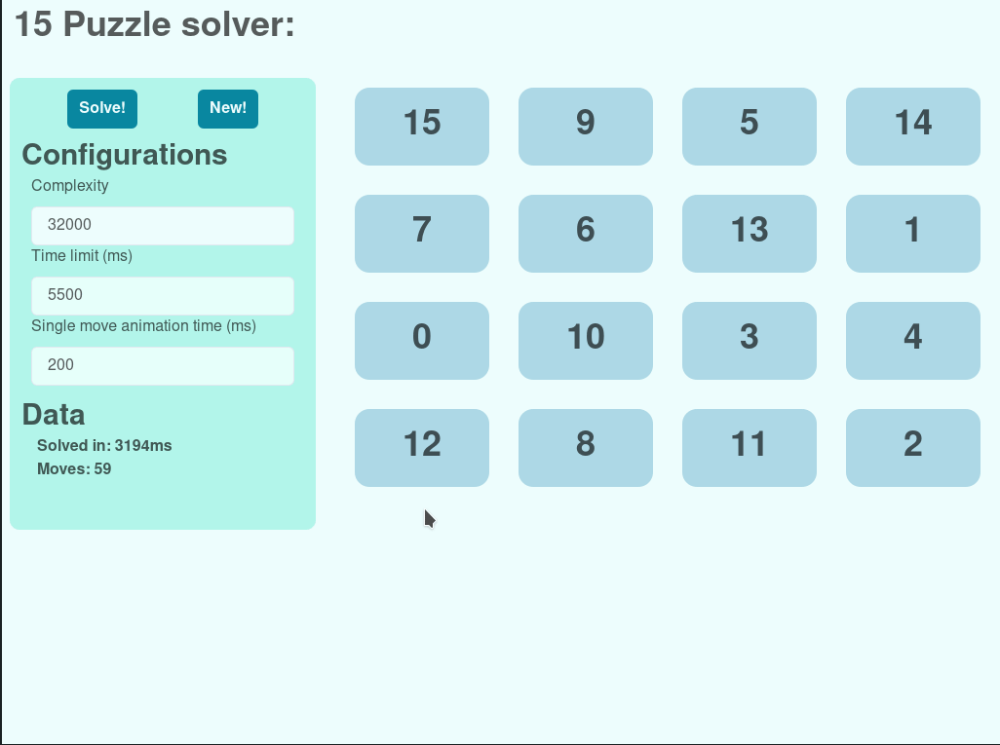

# 15GoFast :dizzy:



## About

15 puzzle solver implementation with [golang](https://go.dev).

Generally the algorithmic implementation of the application focuses on the fastest possible solve time. In hindsight the implementation could be even faster, but generally the algorithm implementation achieves faster solve times than many other 15 puzzle solvers. I’ll add some proof to these claims <i>later</i>.

</br>

### Stack

- Algo     : [IDA*](https://en.wikipedia.org/wiki/Iterative_deepening_A*)
- Heuristic: [Walking distance](https://web.archive.org/web/20141224035932/http://juropollo.xe0.ru:80/stp_wd_translation_en.htm)
- Frontend : [Wails (React)](https://wails.io/)
- Language : [golang](https://go.dev)

### Dependencies
- [Wails (React)](https://wails.io/)
- [golang](https://go.dev)
- [Node](https>//nodejs.org)

## Reports

[week 1](https://github.com/ferealqq/15GoFast/blob/main/documentation/week1.md)
[week 2](https://github.com/ferealqq/15GoFast/blob/main/documentation/week2.md)
[week 3](https://github.com/ferealqq/15GoFast/blob/main/documentation/week4.md)
[week 4](https://github.com/ferealqq/15GoFast/blob/main/documentation/week4.md)
[week 5](https://github.com/ferealqq/15GoFast/blob/main/documentation/week5.md)
[week 6](https://github.com/ferealqq/15GoFast/blob/main/documentation/week6.md)

## Usage

### Executable applications can be found in the [releases page](https://github.com/ferealqq/15GoFast/releases)

Start:
```terminal
# linux 
wget https://github.com/ferealqq/15GoFast/releases/download/v0.0.1/15GoFast-linux-amd
chmod +x 15GoFast-linux-amd
./15GoFast-linux-amd
```

```terminal
# macos  
wget https://github.com/ferealqq/15GoFast/releases/download/v0.0.1/15GoFast-darwin
chmod +x 15GoFast-darwin
./15GoFast-darwin
```

```terminal
# windows  
echo "Don't know, not sure, don't want to find out"
```

## Installation 

- Install node: [here](https://nodejs.org/en/download/)
- Install golang: [here](https://go.dev/doc/install)
- Install wails: [guide](https://wails.io/docs/gettingstarted/installation)
  - If you are familiar with go you can install wails with command: `go install github.com/wailsapp/wails/v2/cmd/wails@latest`

Run:
```terminal
wails dev
```

## Live Development

To run in live development mode, run `wails dev` in the project directory. This will run a Vite development
server that will provide very fast hot reload of your frontend changes. If you want to develop in a browser
and have access to your Go methods, there is also a dev server that runs on http://localhost:34115. Connect
to this in your browser, and you can call your Go code from devtools.

## Building

To build a redistributable, production mode package, use `wails build`.


## Testing

To test the core logic of the application run: 
```terminal
# takes 1s to 8s depending on how hard the random generated puzzles are.
go test . 
```

Some times the tests may exceed the time limit of solving the puzzle board. But exceeding the time limit should be very <i>rare</i>.

## Profiling 


Profiling is done with [pprof](https://pkg.go.dev/runtime/pprof).
Usage:
```terminal
go tool pprof "profile_file" 
```

To generate profile's use the following [guide](https://pkg.go.dev/runtime/pprof).

Generate IDAStar's cpu profile run
```terminal
go clean --cache ; go clean -testcache ; go test -run "TestPerformance" -cpuprofile cpu.prof
go tool pprof search.prof
(pprof) web
```
